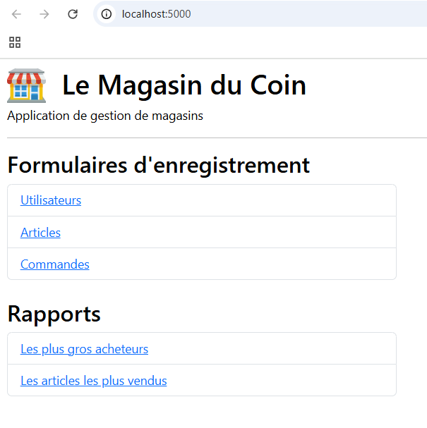
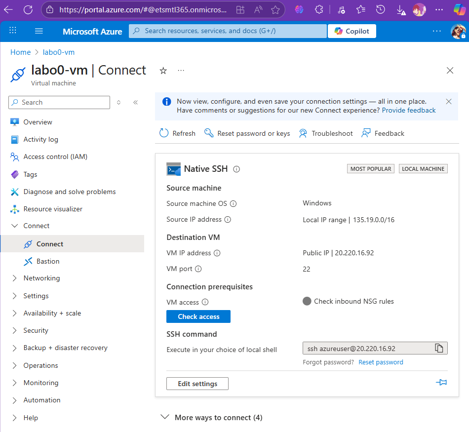
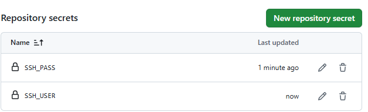
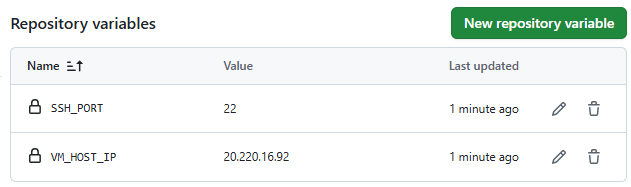
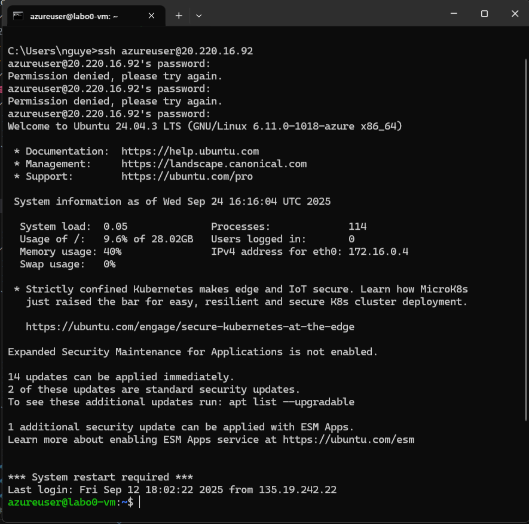
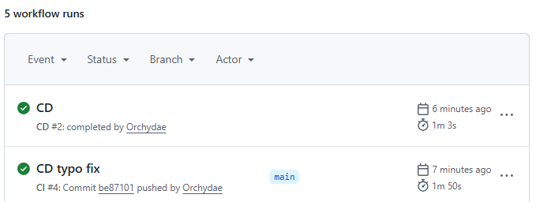
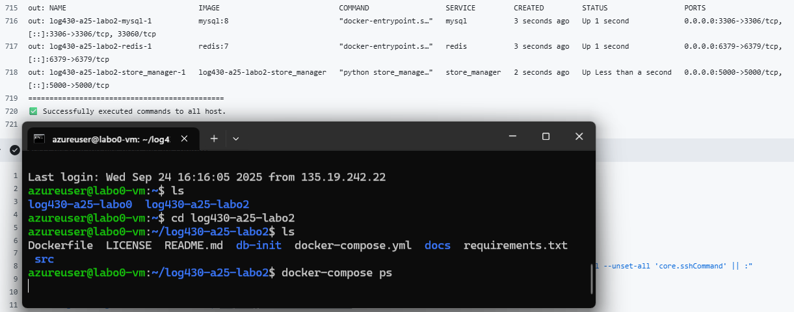
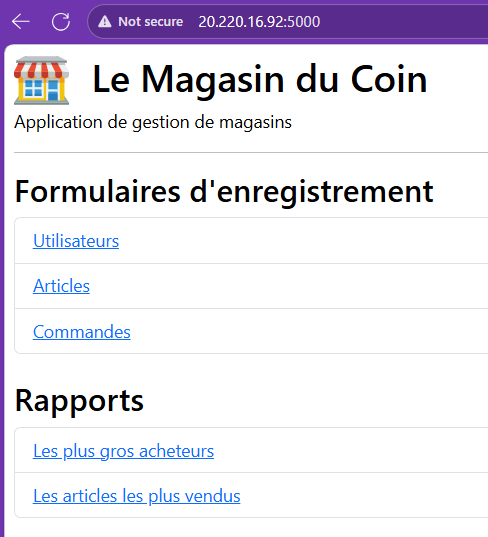

<!-- Page de présentation -->
<div align="center">

<!-- Titre du document (18 pts) -->
<center>
<h1 style="font-size:18pt;">
Rapport du laboratoire 2
</h1>
</center>

<!-- 4 retours à interligne simple (18 pts) -->
<br>
<br>
<br>
<br>

<!-- (16 pts) -->
<center>
<h2 style="font-size:16pt;">
PAR
</h2>
</center>

<!-- 2 retours à interligne simple (16 pts) -->
<br>
<br>

<!-- Prénom et NOM DE FAMILLE, CODE PERMANENT (16 pts) -->
<center>
<h2 style="font-size:16pt;">
David NGUYEN, NGUD24049607
</h2>
</center>

<!-- 6* retours à interligne simple (16 pts) -->
<!-- * Devrait être 5 retours -->
<br>
<br>
<br>
<br>
<br>
<br>

<!-- Note de présentation (14 pts) -->
<center>
<h3 style="font-size:14pt;">
RAPPORT PRÉSENTÉ À FABIO PETRILLO DANS LE CADRE DU COURS <em>ARCHITECTURE LOGICIELLE</em> (LOG430-02)
</h3>
</center>

<!-- 5 retours à interligne simple (14 pts) -->
<br>
<br>
<br>
<br>
<br>

<!-- Date de remise (14 pts) -->
<center>
<h3 style="font-size:14pt;">
MONTRÉAL, LE 26 SEPTEMBRE 2025
</h3>
</center>

<!-- 5 retours à interligne simple (14 pts) -->
<br>
<br>
<br>
<br>
<br>

<!-- Date de présentation (14 pts) -->
<center>
<h3 style="font-size:14pt;">
ÉCOLE DE TECHNOLOGIE SUPÉRIEURE<br>
UNIVERSITÉ DU QUÉBEC
</h3>
</center>

<!-- 5 retours à interligne simple (14 pts) -->
<br>
<br>
<br>
<br>
<br>

</div>  


---  
<h1> Tables des matières </h1>

- [Mise en place](#mise-en-place)
- [Question 1](#question-1)
- [Question 2](#question-2)
- [Question 3](#question-3)
- [Question 4](#question-4)

---

# Mise en place
Le projet a été fork, puis ensuite clôné. Le fichier `.env` a été créé à partir du `.env.example` et `docker-compôse.yml`. En ce qui concerne le port 5000, `store_manager` écoute à l'intérieur du conteneur sur le port 5000 (par défaut, les ports d'un conteneur ne sont pas accessibles depuis la machine, car ils sont isolés). Donc, selon ma compréhension, si je veux ouvrir mon navigateur et aller sur http://localhost:5000, il faut dire à Docker: "Le port 5000 de ma machine hôte doit être relié au port 5000 du conteneur". Ainsi, dans mon `docker-compose.yml`, j'y ai ajouté  
```
store_manager:
    build: .
    volumes:
      - .:/app
    environment:
      DB_HOST: mysql        
      DB_PORT: 3306
      DB_USER: labo02
      DB_PASSWORD: labo02
      DB_NAME: labo02_db
      REDIS_HOST: redis
      REDIS_PORT: 6379
      REDIS_DB: 0
    ports:
      - "5000:5000" # Nouvellement ajouté!
    depends_on:
      - mysql
      - redis
```
Par la suite, j'ai `docker compose build` et `docker compose up -d` pour orchestrer les conteneurs ensemble.

Ainsi, on peut lancer l'application dans son conteneur, soit en allant sur http://localhost:5000/ pour voir la vue de l'application. 

Finalement, pour la préparration de l'environnement de déploiement et le pipeline, j'ai commencé par exécuter les tests en local:
```
python -m venv .venv
.venv/Scripts/Activate.ps1
pip install -r requirements.txt
pytest -q
```

Le fichier `ci.yml` a été modifié en fonction du CI. J'ai procédé par la suite au versionnage du code avec:

```
git add .
git commit -m "MESSAGE DE COMMIT"
git push
```

> À noter qu'il y a eu un changement au niveau du script `init_sql`. De ce fait, j'ai appliqué les changements, puis j'ai rebuild les images comme suit:
```
docker compose down
docker volume ls 
docker volume rm log430-a25-labo2_mysql_data
docker build .
docker compose up -d
```

Maintenant, au niveau du CD, ma stratégie est d'y aller avec la VM de Azure (étant donné qu'actuellement nous travaillons encore à distance et donc les locaux de l'école ne sont pas accessibles).


Ensuite, les secrets et les variables ont été configurés dans le repo GitHub:



Par la suite, j'ai vérifié la connectivité depuis ma machine locale en m'y connectant:


En ce qui concerne le déploiement, j'ai ajouté le fichier `cd.yml` qui dépend du fichier `ci.yml` et après un `git push` on peut voir sur GitHub Actions que le workflow fonctionne bien, car la commande `docker-compose ps` montre que les services roulent:



Finalement, j'ai ajouté mon fichier .env dans la VM et puis j'ai lancé la commande `docker-compose up -d --build` faisant en sorte que l'application est officiellement déployée sur http://20.220.16.92:5000:


# Question 1
> Lorsque l'application démarre, la synchronisation entre Redis et MySQL est initialement déclenchée par quelle méthode ? Veuillez inclure le code pour illustrer votre réponse.

La méthode `sync_all_orders_to_redis()` est appelée au démarrage de l'application. C'est elle qui copie toutes les commandes de MySQL vers Redis (mais seulement si Redis est vide).

```
# === store_manager.py ===
if __name__ == "__main__":
    # Sync MySQL -> Redis
    print("Initial sync MySQL -> Redis")
    sync_all_orders_to_redis()

    # Démarrage du serveur
    server = HTTPServer(("0.0.0.0", 5000), StoreManager)
    print("Server running on http://0.0.0.0:5000")
    server.serve_forever()
```

# Question 2
> Quelles méthodes avez-vous utilisées pour lire des données à partir de Redis ? Veuillez inclure le code pour illustrer votre réponse.

- `keys("order:*")`: pour lister les clés d'orders (on exclut celles finissant par `:items`).
- `hgetall(f"order:{oid}")`: pour lire les champs du hash d'une commande (user_id, total_amount).

```
def get_orders_from_redis(limit=9999):
    """Get last X orders"""
    r = get_redis_conn()

    # 1) Lister les cles de type order:* et extraire les IDs
    keys = r.keys("order:*")
    order_ids = []
    for k in keys:
        if k.endswith(":items"):
            continue
        try:
            order_ids.append(int(k.split(":")[1]))
        except:
            continue

    # 2) Trier les IDs par ordre décroissant et limiter le nombre de résultats
    order_ids.sort(reverse=True)
    order_ids = order_ids[:limit]

    # 3) Lire les hashes correspondants en pipeline
    pipe = r.pipeline()
    for oid in order_ids:
        pipe.hgetall(f"order:{oid}")
    orders = pipe.execute()

    # 4) Retourner des objets (id, total_amount) pour la vue
    OrderRow = type("OrderRow", (), {})
    result = []
    for oid, h in zip(order_ids, orders):
        if not h:
            continue
        row = OrderRow()
        row.id = oid
        row.total_amount = float(h.get('total_amount', 0))
        result.append(row)
    return result
```

# Question 3
> Quelles méthodes avez-vous utilisées pour ajouter des données dans Redis ? Veuillez inclure le code pour illustrer votre réponse.


Pour ajouter des données dans Redis, j'ai utilisé:
1. `hset(`key, mapping=...)` pour écrire le hash de la commande;
2. `delete(key)` pour réinitialiser la liste d'items avant d'écrire;
3. `rpush(key, value)` pour empiler chaque item (JSON) dans la liste

``` 
def add_order_to_redis(order_id, user_id, total_amount, items):
    """Insert order to Redis
    - order:{id} -> hash (user_id, total_amount)
    - order:{id}:items -> list of JSON items (product_id, quantity, unit_price)
    """
    r = get_redis_conn()
    # Hash + list of JSON items
    order_key = f"order:{order_id}"
    items_key = f"{order_key}:items"

    # 1) Hash des metadonnees (cree ou remplace)
    r.hset(order_key, mapping={
        "user_id": int(user_id),
        "total_amount": float(total_amount)
    })

    # 2) Liste des items (reinitialise)
    r.delete(items_key)  # Supprime les items existants, s'il y en a
    for item in items:
        """ Tolerons deux formes:
        - dict: {'product_id': 1, 'quantity': 2}
        - objet SQLAlchemy: OrderItem(product_id=1, quantity=2, unit_price=9.99)
        """
        if isinstance(item, dict):
            product_id = int(item["product_id"])
            quantity = float(item["quantity"])
            unit_price = float(item["unit_price"])
        else:
            product_id = int(item.product_id)
            quantity = float(item.quantity)
            unit_price = float(item.unit_price)
        
        r.rpush(items_key, json.dumps({
            "product_id": product_id,
            "quantity": quantity,
            "unit_price": unit_price
        }))
    print(r)
```

# Question 4
> Quelles méthodes avez-vous utilisées pour supprimer des données dans Redis ? Veuillez inclure le code pour illustrer votre réponse.

La méthode `delete(key)` a été utilisée pour retirer les clés liées à une commande.
```
def delete_order_from_redis(order_id):
    """Delete order from Redis"""
    r = get_redis_conn()
    r.delete(f"order:{order_id}")
    r.delete(f"order:{order_id}:items")
```

# Question 5
> Si nous souhaitions créer un rapport similaire, mais présentant les produits les plus vendus, les informations dont nous disposons actuellement dans Redis sont-elles suffisantes, ou devrions-nous chercher dans les tables sur MySQL ? Si nécessaire, quelles informations devrions-nous ajouter à Redis ? Veuillez inclure le code pour illustrer votre réponse.

Les informations que nous disposons dans Redis sont effectivement suffisantes, car pour chaque commande, on peut agréger par `product_id` directement depuis Redis (sans lire MySQL).

```
def get_highest_spending_users(limit=10):
    """Get report of best selling products for Redis only"""
    r = get_redis_conn()

    # 1) Recuprer les cles d'ordres
    order_keys = [k for k in r.keys("order:*") if not k.endswith(":items")]

    # 2) Lire tous les hashes en pipeline
    pipe = r.pipeline()
    for k in order_keys:
        pipe.hgetall(k)
    hashes = pipe.execute()

    # 3) Agréger par user_id
    expenses_by_user = defaultdict(float)
    for h in hashes:
        if not h: continue
        try: 
            uid = int(h.get('user_id', 0))
            total = float(h.get('total_amount', 0))
        except Exception:
            continue
        expenses_by_user[uid] += total

    # 4) Trier et limiter
    get_highest_spending_users = sorted(
        expenses_by_user.items(), 
        key=lambda x: x[1], 
        reverse=True
    )[:limit]

    # 5) Retourner une liste de dicts
    Row = type("UserSpendingRow", (), {})
    result = []
    for uid, total in get_highest_spending_users:
        row = Row()
        row.user_id = uid
        row.total_spent = total
        result.append(row)

    return result
```
